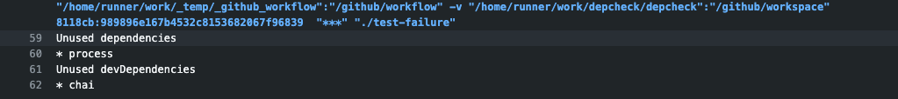

[](https://github.com/tj-actions/depcheck/actions?query=workflow%3ACI)

depcheck
--------

Analyze npm project dependencies using [depcheck](https://github.com/depcheck/depcheck).



```yaml
...
    steps:
      - uses: actions/checkout@v2
      - name: npm-depcheck
        uses: tj-actions/depcheck@v0.a
        with:
          extra-args: '.'
```

* Free software: [MIT license](LICENSE)

Features
--------

* TODO


Credits
-------

This package was created with Cookiecutter.


Report Bugs
-----------

Report bugs at https://github.com/tj-actions/depcheck/issues.

If you are reporting a bug, please include:

* Your operating system name and version.
* Any details about your workflow that might be helpful in troubleshooting.
* Detailed steps to reproduce the bug.
